# Support Hub

Support Hub is a proof of concept SaaS (software as a service) solution to provide a hosted customer support portal to small enterprises.

Customers (once registered) can raise support requests (tickets) to report incidents or problems. These tickets can then be picked up by a team of internal support staff (technicians) to work towards a resolution.

The site uses custom roles to determine the functionality available to authenticated users.

- Customers can create tickets but only view, edit, and leave comments on their tickets.
- Technicians can create, view, edit, comment on, and delete all tickets. They can also access a wide range of filtering options which provides a way to customize their ticket list.
- The Customer and the Technician roles are both able to edit their user details using the profile section.
- An Administrator can use the site the same way a technician can, with the additional ability to search for users and change their role and team. Allowing technicians to onboard new staff and manage existing users.
- Finally, a superuser can configure the site (Teams, Categories) using the Django admin portal.

This is the 4th portfolio project developed as part of the Code Institute Diploma in Full Stack Development. It was created to demonstrate skills acquired using Django to design and develop websites that offer full CRUD (create, read, update and delete) functionality.

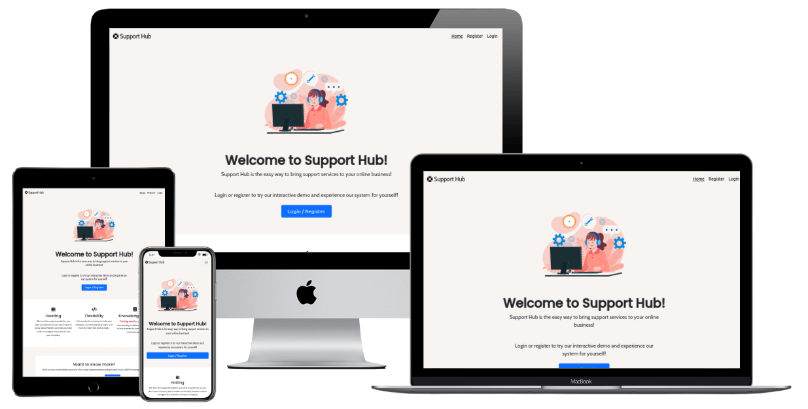

## Demo

[View the live project here.](https://ci-pp4-support-hub.herokuapp.com)

## TOC

- [User Experience (UX)](#user-experience-ux)
  - [Project Aims](#project-aims)
  - [User Stories](#user-stories)
    - [Epic: Authentication](#epic-authentication)
    - [Epic: Account Management](#epic-account-management)
    - [Epic: Ticket Management](#epic-ticket-management)
    - [Epic: Notifications](#epic-notifications)
    - [Epic: Application Configuration](#epic-application-configuration)
  - [Agile Methodology](#agile-methodology)
  - [Design](#design)
    - [Wireframes](#wireframes)
    - [Colour Scheme](#colour-scheme)
    - [Typography](#typography)
    - [Images and Iconography](#images-and-iconography)
    - [Database Schema](#database-schema)
    - [Design changes](#design-changes)
- [Features](#features)
  - [Features Not Implemented](#features-not-implemented)
  - [Future Features](#future-features)
- [Technologies Used](#technologies-used)
  - [Languages Used](#languages-used)
  - [Python Modules and Packages/Frameworks Used](#python-modules-and-packagesframeworks-used)
  - [Programs and Tools Used](#programs-and-tools-used)
- [Testing](#testing)
  - [Bugs](#bugs)
    - [Fixed Bugs](#fixed-bugs)
    - [Remaining Bugs](#remaining-bugs)
- [Deployment](#deployment)
  - [Forking the GitHub Repository](#forking-the-github-repository)
  - [Making a Local Clone](#making-a-local-clone)
  - [Deploying with Heroku](#deploying-with-heroku)
- [Credits](#credits)
  - [Online resources](#online-resources)
  - [Code](#code)
  - [Media](#media)
  - [Acknowledgments](#acknowledgments)

## User Experience (UX)

### Project Aims

The initial aims of the project which formed the basis for user story creation were identified as the following:

- Create a support ticketing system where customers can seek assistance with problems by creating, editing and leaving comments on tickets.
- Allow support staff to view, filter, edit and delete tickets and communicate with customers via the ticket.
- Allow management of users by administrators. This is so support staff can self enrol, have their role set, and be placed in a team.

### User Stories

NOTE: The **Staff Member** role was renamed to **Customer** towards the end of development. This was based on feedback to bring the role further in line with the site purpose but user stories still refer to this role as **Staff Member**.

Acceptance criteria for each user story can be viewed within the linked GitHub issue.

#### Epic: Authentication

User Stories

1. As a User, I can register for a new account so that I can use the service to request assistance. [GitHub Issue #4](https://github.com/ianmeigh/support-hub/issues/4#issue-1300480926)
1. As a User, I can login to my account so that I can use the service using my existing credentials. [GitHub Issue #5](https://github.com/ianmeigh/support-hub/issues/5#issue-1300500748)
1. As a User, I can logout of my account so that I can keep my account secure on shared devices. [GitHub Issue #6](https://github.com/ianmeigh/support-hub/issues/6#issue-1300503193)

#### Epic: Account Management

User Stories

1. As a User, I can reset my password without supervision so that I can keep my account secure and/or regain access to the system if my password is forgotten. [GitHub Issue #7](https://github.com/ianmeigh/support-hub/issues/7#issue-1300508183)
1. As a User, I can maintain a profile so that I can add and update contact information. [GitHub Issue #27](https://github.com/ianmeigh/support-hub/issues/27#issue-1300652845)
1. As an Admin, I can change user roles so that I can convert staff users to technicians. [GitHub Issue #18](https://github.com/ianmeigh/support-hub/issues/18#issue-1300600899)

#### Epic: Ticket Management

User Stories

1. As a Staff Member, I can create a ticket so that I can request assistance with my problem. [GitHub Issue #8](https://github.com/ianmeigh/support-hub/issues/8#issue-1300514504)
1. As a Staff Member, I can view all tickets created by me so that I can track all requests raised by me. [GitHub Issue #9](https://github.com/ianmeigh/support-hub/issues/9#issue-1300522621)
1. As a User, I can view individual tickets so that I can check ticket progress. [GitHub Issue #10](https://github.com/ianmeigh/support-hub/issues/10#issue-1300534372)**\***
1. As a Staff Member, I can edit my tickets so that I can correct mistakes made when describing my problem. [GitHub Issue # 11](https://github.com/ianmeigh/support-hub/issues/11#issue-1300559623)
1. As a User, I can add notes/comments to my tickets so that I can add additional information and/or respond to the notes/comments of others.**\*** [GitHub Issue # 12](https://github.com/ianmeigh/support-hub/issues/12#issue-1300566063)
1. As a Technician, I can create a ticket so that I can request assistance with my problem or create a ticket on behalf of another user if raised via a different communication channel (email, etc..). [GitHub Issue #13](https://github.com/ianmeigh/support-hub/issues/13#issue-1300574169)
1. As a Technician, I can view all tickets so that I can track all requests raised by me and see all work pending resolution that I can work on. [GitHub Issue #14](https://github.com/ianmeigh/support-hub/issues/14#issue-1300580490)
1. As a Technician, I can edit ticket (more fields than user) so that I can correct mistakes and change other fields in the ticket to update its status and assigned team and /or technician. [GitHub Issue #15](https://github.com/ianmeigh/support-hub/issues/15#issue-1300587833)
1. As a Technician, I can delete tickets so that I can remove erroneous tickets to reduce the size of the queue. [GitHub Issue #16](https://github.com/ianmeigh/support-hub/issues/16#issue-1300591338)
1. As a User, I can filter my list of tickets so that I can more easily find the individual ticket I am looking for. [GitHub Issue # 28](https://github.com/ianmeigh/support-hub/issues/28#issue-1300719432)

#### Epic: Notifications

User Stories

1. As a User, I can receive email notifications so that I know when my ticket has been updated without having to manually check my tickets. [GitHub Issue #17](https://github.com/ianmeigh/support-hub/issues/17#issue-1300594389)

#### Epic: Application Configuration

User Stories

1. As a Admin, I can add team names so that tickets can be assigned to internal teams. [GitHub Issue #19](https://github.com/ianmeigh/support-hub/issues/19#issue-1300605203)

**\*** *Duplicate user stories which described the same functionality for multiple roles were merged during initial development. The title of this user story was updated to reflect this change but the role was initially overlooked and only changed later.*

### Agile Methodology

All user stories were entered as issues in a GitHub Kanban project and assigned labels using the MoSCoW prioritization technique. The live project board can be found on the repository's project tab (classic project section as of 07/22) or on the following link:

[Support Hub - Ticketing System User Stories - Kanban Board](https://github.com/ianmeigh/support-hub/projects/1).

Pull requests where linked with a user story when they contributed to completion of the acceptance criteria.

### Design

#### Wireframes

I created Wireframes to visualize the site's design and act as a template to use when developing the templates. When designing the site I wanted to ensure the site looked and functioned just as well on mobile as larger viewports. Customers may use phones as their primary device to raise and view requests and this also offers flexibility to support staff to work from any device.

- [Wireframe Links Mobile](docs/wireframes/desktop/)
- [Wireframe Links Desktop](docs/wireframes/mobile/)

#### Colour Scheme

Colours used throughout the site were kept to a minimum to keep its focus clear, allow status information to stand out, and present a professional look. The site was envisaged as a solution that could be used by small businesses who should be able to customize the look to suit their brand. This 'stock' version of the site uses muted colours, but future version would allow elements to be easily customized using stylesheet variables.

The background colour is a calming Pastel off-white selected to provide contrast between the body and interactive elements on the page.


hsl(24, 26%, 96%);

#### Typography

Google fonts was used in this project with both fonts selected for their legibility and simplicity.

[Poppins](https://fonts.google.com/specimen/Poppins) - Use in headings.
[Cabin](https://fonts.google.com/specimen/Cabin) - Use in paragraphs and labels.

#### Images and Iconography

A lifebuoy icon was selected as the site logo due to its use in emergency rescues and as a symbol of something that is reached for when help is required (in certain situations). The icon (as with all others in the site) are from [Font Awesome](https://fontawesome.com/).

The index/home page hero image was taken from [freepik](https://www.freepik.com). It was selected for its friendly, appealing and professional tone. Light editing work was undertaken using the [Artwork Recolor](https://coolors.co/image-recolor) tool from [coolors.co](https://coolors.co) to ensure the image matched the site's aesthetic.

The favicon was created from an image found on [flaticon](https://www.flaticon.com) and was used to match the logo icon of a lifebuoy.

#### Database Schema

5 custom models were created based on the initial database schema design as below. The CustomUser model was created first as this extended the AbstractUser class to allow roles to be added. The Ticket, Team, TicketCategory and Comment models were then created in turn as required by the user stories.

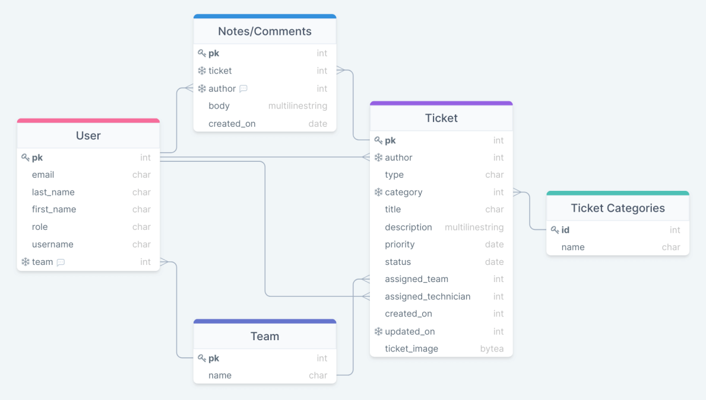

#### Design changes

The original ticket list view used a list to display ticket information. When development started this proved difficult to make responsive without creating different views for different viewports. The original layout can be viewed using the link below with the updated layout in the wireframes section.

[Old Ticket List Wireframe](docs/wireframes/desktop/wireframes-tickets-list-old-desktop.png)

## Features

1. Home Page

    - The functionality of the site is restricted to registered users in line with its purpose to assist individuals. The home page was therefore designed to welcome customers and provide an introduction to make the site purpose clear. There are clear links to encourage visitors to signup and allow existing users to login. The home page is fully responsive and is based on the site's base template, therefore includes the site wide navigation and footer elements.

        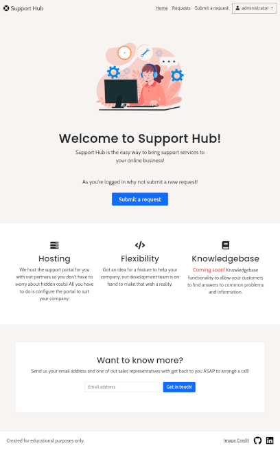

1. Navigation

    - The main navigation bar was designed from the outset to be kept clean and simple. The purpose of this design is to highlight the main functionality of the site (viewing and submitting requests). While links to the site's main functionality are always visible when authenticated, other links were moved to a bootstrap dropdown. The dropdown main function is to contain links to the profile, user search and logout links but it also informs the authenticated user which account they are currently logged in with.

    - The navigation bar is responsive and will collapse to a 'hamburger' style menu when viewed on devices with smaller viewports. The drop down will be hidden and the links to other features displayed in a list to prevent the nesting of dropdowns.

    - The navigation is fixed and will scroll with the user. This aligns with the aim to keep the site's main functionality within reach at all times.

    - Unauthenticated users are shown links to register and login.

        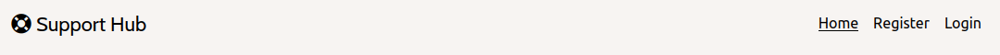

    - Authenticated users will be shown their current username in a dropdown at the far right of the navigation bar along with links to view and submit requests/tickets.
    - The content of the dropdown changes based on the users role, with the 3 roles of the site being Customer, Technician and Administrator.
    - Customers and Technicians will see links to manage their profile and logout.

        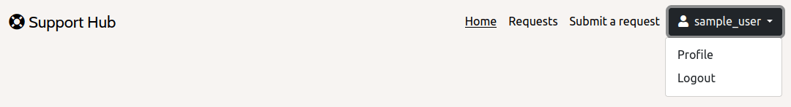

    - Administrators see links to manage their profile and logout, but also the link to the user search page.

        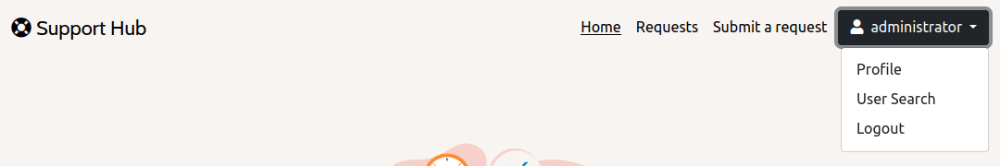

    - Navigation on smaller viewports

        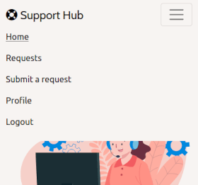

1. Signup, Login and other account management pages

    - *django-alauth* was implemented to handle account creation and management of email verification, email address management, password change, etc.

    - The *django-allauth* signup page shown below was extended to request a user's name as part of the signup process. This also demonstrates how the styling of the *django-allauth* templates were altered to make them cohesive with the rest of the site. Forms were styled using the *crispy-bootstrap5* package.

        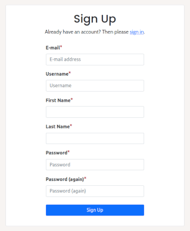

1. Ticket List

    - The ticket list view was designed to convey maximum information about the individual tickets in a compact space and provide glanceable information such as the clear status icons and the time since the last update had been made to the ticket. When the ticket is edited or a comment is entered, this will be reflected by the last update.

    - The ticket list differs based on the logged-in users role, with customers only able to see tickets of which they are the author. Technicians and Administrators can see all tickets.

    - Bootstrap cards were used to contain the individual ticket information. Ticket detail can be viewed by clicking on the title of the ticket or using the button within the card.

        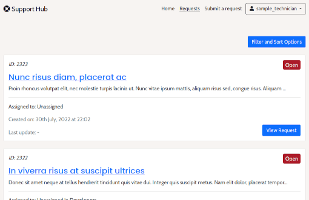

1. Filters

    - The ticket list has the potential to become very crowded as more teams are added and tickets logged. To ease this issue the *django-filters* package was used to create a custom filterset that allows Customers to filter tickets by Status and sort by creation date. Technicians can filter the ticket list with more precision, which includes an option to see only the tickets they have are assigned.

        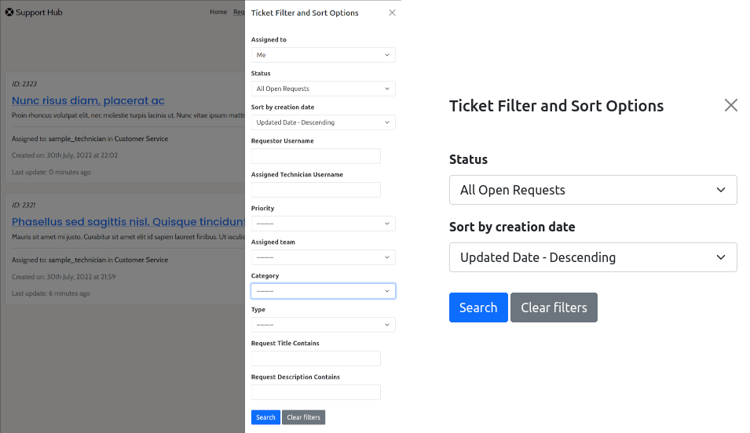

1. Ticket Management - Customer Role

    - Users with the customer role can create, edit and comment on tickets. The customer ticket creation and edit forms contain limited fields to allow essential information to be entered, but fields used to administer tickets are restricted to elevated user roles. Select image formats can be uploaded when creating a ticket as supplementary information. This image can be also be updated or removed.

    - Customers can only view, edit and comment on tickets they have authored. If they try to navigate to tickets they have not authored they will be directed to a custom 403 Forbidden page.

    - Custom Model validators were created to ensure only valid images of specified types and size (bytes) could be uploaded. Image validation was implemented using the Pillow package after experimentation with both the Cloudinary and django builtin ImageField. [Link to 'validators.py'](https://github.com/ianmeigh/support-hub/blob/7690647c554e284eb4ba040983805f89fa4188f8/tickets/validators.py)

    - Validators were created to ensure ticket descriptions and comments could not be submitted if they started with any whitespace (to avoid empty fields being accepted). This validator class was used to ensure that certain field entries met a minimum length requirement to prompt a greater level of detail to be entered by users. In other cases the django MinLengthValidator was used to achieve this functionality.

    - Any validation errors would be reported to the user when submitting the form but without the contents of the form being lost.

        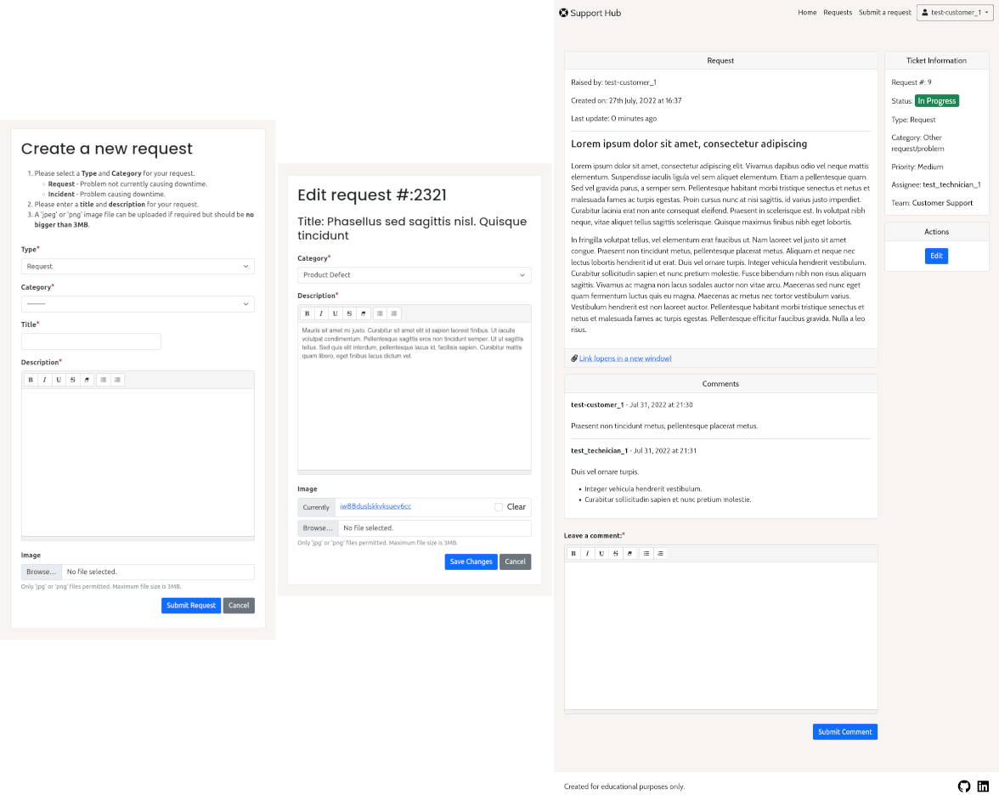

1. Ticket Management - Technician and Administrator Role

    - Users with an elevated role (Technician and Administrator) can create, edit and comment on all tickets. The elevated user ticket creation and edit forms contain all ticket fields which allows tickets to be created as other users and ticket status and category to be updated. Select image formats can be uploaded when creating a ticket as supplementary information. This image can be also be updated or removed.

    - Elevated user roles can also delete tickets in case they are raised in error (deletion must be confirmed). Deletion of a ticket with an image will also delete the image from the Cloudinary hosting platform using a signal.

    - These forms and models were subject to the same validation as the customer forms above.

        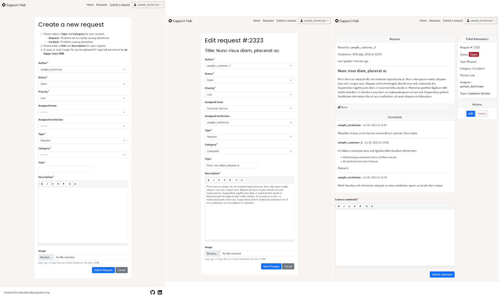

        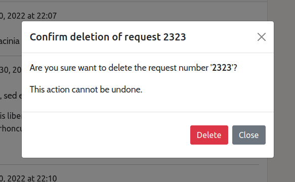

1. Profile Management - Customer and Technician Roles

    - Users are able to change the first and last name they registered with and their username. The profile also acts as a place to link to other *django-allauth* features to allow the management of email addresses and password change functionality.

        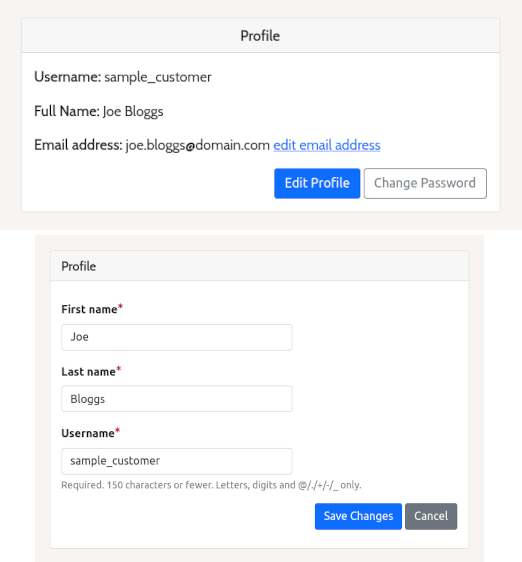

1. User Management - Administrator Role

    - The Administrator role has access to a page where users can be searched for and their profiles viewed. The user's name and email can be viewed but cannot be edited.

    - The purpose of this view is to allow a user with the administrator role to change a user's role and team. User can then register for the site without supervision and be assigned the correct role and team as part of an onboarding process.

        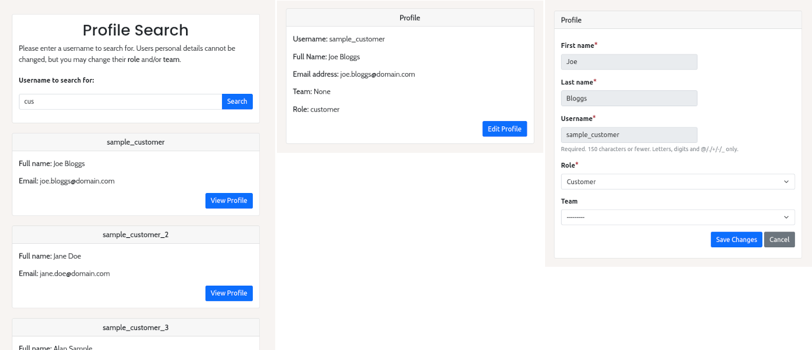

1. Messaging and Email

    - Bootstrap toasts were used in conjunction with Django messaging framework to report success and errors to customers as they used the site.

    - Entering an invalid url (integer) will direct users to a custom 404 Error page. If the user enters a string as the ticket slug, they will be directed to the home page and be informed of the error.

        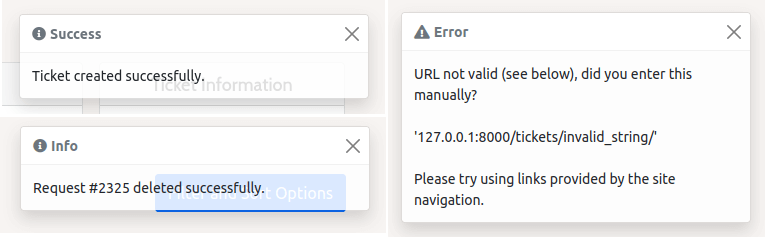

    - When a comment is left on a ticket by anyone other than the ticket's author, an email will be sent to that user's email address informing them.

        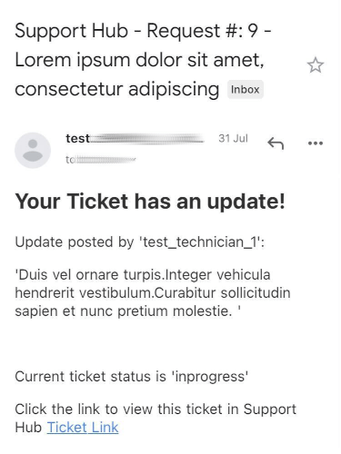

### Features Not Implemented

1. Managing Teams and Ticket Categories

    - This feature would have allowed users with the administrator role to add, edit and remove Teams and Ticket categories so there would be no need to involve a SuperUser in the configuration of the site beyond Django administration tasks. Due to time constraints this feature could not be completed for this release and the project superuser account must be utilized to configure these items.

### Future Features

- Knowledge base
  - A knowledge base is a blog like repository of articles that contains information on a wide range of technical issues. It would usually be searchable and aimed at providing information to customers and assigning them with common problems that can be solved with workarounds.
  - Support sites often allow articles to be marked as internal and external documents which allows for the creation of a knowledge base with articles targeted at internal employees.
  - User stories have already been created for this feature to be implemented to form the work for the next release:
    - [Link to GItHub Knowledge Base User Stories](https://github.com/ianmeigh/support-hub/projects/3)
- Private ticket notes
  - Elevated users would be able to post comments on a ticket that are only visible to other elevated users. Useful where information to complete the request is not pertinent to the customer but is required internally. Examples of this would be updates from 3rd parties, technical updates from the developments teams or simply summary updates before a ticket is passed to another team.
- Resolution comment or separate field when marking as closed.
  - The ability to mark one comment as the resolution point of the issue. As tickets can be filtered, this could be incorporated to the filterset allowing elevated users to search by resolution or easily see how the problem was resolved without reading through all ticket comments.
- Ticket status, New, Unread Comments, Read Comments.
  - Highlight tickets as new, read or unread depending on activity. If a technician comments on a ticket an email is currently sent to the user who logged the ticket as a means of notification. I would like to couple this with a feature that keeps track if the author has read the update so they can easily see which tickets require attention when logged in. This should also be implemented for elevated users so they can see which tickets are awaiting response.
- Profile Picture
  - Allow users to upload profile pictures. This feature would be available to all users but for externally facing support staff, a profile picture can elicit trust and reassure customers they are dealing with an individual.
- Editable fields shown directly on the detail page, rather than having to edit tickets.
  - This would be to allow elevated users to quickly update ticket fields such as ticket status, priority, assigned team etc.
- Social Login
  - The ability for users to use social accounts when registering for a new account would remove the requirement for the site to store password information and encourage trust among users who are wary when signing up for new services.
- Site Style Customization
  - As the site is designed to be adopted by companies, the ability to easily change the styling of page elements from a dashboard interface is planned. This would enable easier, hands off, brand integration.

## Technologies Used

### Languages Used

- HTML5
- CSS3
- Python
- Javascript

### Python Modules and Packages/Frameworks Used

- Built-in Packages/Modules
  - [smtplib](https://docs.python.org/3/library/smtplib.html#smtplib.SMTPException) - Used to import SMTPException used when catching errors sending emails.
  - [datetime](https://docs.python.org/3/library/datetime.html) - Used to get current time in a timezone aware format to use when updating tickets.
  - [os](https://docs.python.org/3/library/os.html) - This module provides a portable way of using operating system dependent functionality.

- External Python Packages
  - [cloudinary](https://pypi.org/project/cloudinary/1.29.0/) - Used for the Ticket Image Model field, Image upload and deletion.
  - [crispy-bootstrap5](https://pypi.org/project/crispy-bootstrap5/0.6/) - Used to style form using Bootstrap5
  - [dj-database-url](https://pypi.org/project/dj-database-url/0.5.0/) - Allows the use of 'DATABASE_URL' environmental variable in the Django project settings file to connect to a PostgreSQL database.
  - [dj3-cloudinary-storage](https://pypi.org/project/dj3-cloudinary-storage/0.0.6/) - Facilitates integration with Cloudinary by implementing Django Storage API.
  - [Django](https://pypi.org/project/Django/3.2.14/) - High-level Python Web framework used to develop the project
  - [django-allauth](https://pypi.org/project/django-allauth/0.51.0/) - Set of Django application used for account registration, management and authentication.
  - [django-crispy-forms](https://pypi.org/project/django-crispy-forms/1.14.0/) - Used to format form elements and layout.
  - [django-filter](https://pypi.org/project/django-filter/22.1/) - Application that allows dynamic QuerySet filtering from URL parameters.
  - [django-model-utils](https://pypi.org/project/django-model-utils/) - Easily add choices to a django model field.
  - [django-summernote](https://pypi.org/project/django-summernote/0.8.20.0/) - Allows easy use of the Summernote WYSIWYG editor in Django projects.
  - [gunicorn](https://pypi.org/project/gunicorn/20.1.0/) - Python WSGI HTTP Server
  - [Pillow](https://pypi.org/project/Pillow/9.2.0/) - Fork of PIL, the Python Imaging Library which provides image processing capabilities.
  - [psycopg2](https://pypi.org/project/psycopg2/2.9.3/) - Python PostgreSQL database adapter

### Programs and Tools Used

- [Google Fonts:](https://fonts.google.com/)
  - Google fonts import statements were used as part of this project to make use
    of the Poppins and Cabin Round fonts which are used on all pages of the
    website.
- [Bootstrap](https://getbootstrap.com/)
  - Bootstrap was used through the project to style the project and create responsive elements/layouts.
- [drawSQL](https://drawsql.app/) - Create Database Schema/ERD
- [Visual Studio Code:](https://code.visualstudio.com/)
  - Visual Studio Code was used as my code editor for this project. A full list
    of plugins used can be found later in this section.
- [Git](https://git-scm.com/)
  - Git was used for version control, using the terminal to commit to Git and
    Push to GitHub.
- [GitHub:](https://github.com/)
  - GitHub is used to store the projects code after being pushed from Git.
- [GIMP:](https://www.gimp.org/)
  - GIMP was used to edit and resize photos for the readme.
- [Balsamiq:](https://balsamiq.com/)
  - Balsamiq was used to create the [wireframes](#wireframes) during the design
    process.
- [Coolors](https://coolors.co/image-recolor)
  - Coolors Artwork Recolor was used to alter the hero images colours.
- [TinyJPG](https://tinyjpg.com/)
  - Used to compress images for the README.
- The following modules were installed or enabled in [Visual Studio
Code](https://code.visualstudio.com/) to assist with formatting and code
linting:
  - [flake8](https://github.com/pycqa/flake8) - Code Linter
  - [black](https://github.com/psf/black) - Code Formatter
- The following [Visual Studio Code](https://code.visualstudio.com/) extensions
  were utilized in the production of this project:
  - [Rewrap](https://marketplace.visualstudio.com/items?itemName=stkb.rewrap) - Used to wrap comments.
  - [Code Spell Checker](https://marketplace.visualstudio.com/items?itemName=streetsidesoftware.code-spell-checker) - Used to spell check content and commits.
  - [indent-rainbow](https://marketplace.visualstudio.com/items?itemName=oderwat.indent-rainbow) - Makes indentation easier to read.
  - [markdownlint](https://marketplace.visualstudio.com/items?itemName=DavidAnson.vscode-markdownlint) - Markdown linting and style checking for Visual Studio Code.
  - [autoDocstring](https://marketplace.visualstudio.com/items?itemName=njpwerner.autodocstring) - Generates python docstrings templates automatically
  - [TODO Highlight](https://marketplace.visualstudio.com/items?itemName=wayou.vscode-todo-highlight) - highlight TODOs, FIXMEs, and any keywords, annotations.
  - [Todo Tree](https://marketplace.visualstudio.com/items?itemName=Gruntfuggly.todo-tree) - Show TODO, FIXME, etc. comment tags in a tree view

## Testing

A separate testing document has been created as [TESTING.md](TESTING.md)

### Bugs

#### Fixed Bugs

- Change context object name to resolve conflict with base template- [Link to Commit](https://github.com/ianmeigh/support-hub/commit/b7d949e24547ac42acfa5de6d51d2ca1f0fe4497)

  Whilst testing viewing other users profiles with the administrator role I noticed the navigation options would change based on the role of the profile's owner. I discovered I had used the same context name for the profile information being passed to the template as already used by the base template when referencing the currently logged in user. A change to the profile information context name resolved this error.

- Assigned_technician set to null when the user is deleted - [Link to Commit](https://github.com/ianmeigh/support-hub/commit/db4f0eb9400a05f05a3c17680eebd2f9e55f0108)

  Before this change, deleting the user account of a technician who was assigned tickets (populating the tickets assigned_technician field) would cause an IntegrityError (FOREIGN KEY constraint failed). This error was the result of an oversight when setting the on_delete behavior of this field in the model. The field was originally set to DO_NOTHING, and therefore the primary key of the technician user would have become orphaned in the ticket table upon deletion leading to the error. Setting the on_delete behavior so the assigned_technician would be set to null resolved this.

- Changing the model ImageField back to a CloudinaryFiled - [Link to Commit](https://github.com/ianmeigh/support-hub/commit/abcccf6fbf8ffd00495b48b4cd382cca7f51929f)

  I encountered problems trying to fully validate images before Cloudinary attempted to upload them. If Cloudinary rejected the image (for being too large, incorrect file type etc.), it would result in internal server errors being displayed to the user.

  A custom validator was created to manage the file type and size (bytes) but I was unable to manage files that were not valid images (e.g. other files types with the file extension changed to .jpg or .png) [e852fb7](https://github.com/ianmeigh/support-hub/commit/e852fb7191ff255d64ef6c21238dd07670c3f56b).

  A fellow student directed me towards using a Django ImageField, which uses Pillow to validate image files. After some experimentation I believed I had resolved the validation issues and implemented this as change [52801f3](https://github.com/ianmeigh/support-hub/commit/52801f39deed1272cf1e3488552fa72ac9ed44f4).

  It was only later when reviewing my testing schedule that I discovered the feature commit mentioned above had broken an existing feature, which used a receiver to remove a tickets image from cloudinary when deleted [0533a36](https://github.com/ianmeigh/support-hub/commit/0533a369b9e56d96f511137fae2ec94b236c7dc2).

  To delete an image from Cloudinary you need the images 'public id', which was now irretrievable due to the use of an ImageField. I reverted the changes made to restore previous functionality and by now had become familiar with the Pillow package as part of my use of the ImageField. I determined that I could use Pillow in my existing validator in the same way the ImageField does. I implemented this functionality in commit [e1416d4](https://github.com/ianmeigh/support-hub/pull/49/commits/e1416d4934f80c24583c1130970775f4f3113142).

- Add common utility function to ensure the slug is an integer - [Link to Commit](https://github.com/ianmeigh/support-hub/commit/14223452c14d20c645265e9517293c94e46e5c53)

  The primary key (PK) is used as the slug throughout the project. If a string was entered as the slug and not checked prior to the PK being referenced in the view, a Value Error and therefore an internal server error would occur, as my view was expecting an Integer value. This function coupled with its use in the 'dispatch' method, prevents any internal server errors being raised and reports the issue to the customer.

- Update summernote settings to enable iframe mode - [Link to Commit](https://github.com/ianmeigh/support-hub/commit/7fb607bdc0adec3a04c65858527e04e0d6d3c6d7)

  Summernote would not render in the admin view. This was due to initially setting iframe mode to False in the projects setting file. This is required if Bootstrap or other CSS framework is not used in the django admin site. Reverted changes and made a note to investigate the use of a CSS framework in the admin site in future projects.

- When editing a ticket, display default text for a tickets current file field - [Link to Commit](https://github.com/ianmeigh/support-hub/commit/895a095e6ef6454d40a835d2eb576198742d5812)

  The *crispy-bootstrap5* template for a file field expects a 'name' property which is used to add text to an anchor element ([Link to crispy-bootstrap5 source code for field_file template](https://github.com/django-crispy-forms/crispy-bootstrap5/blob/ade42e934347eb7d89226f8a9cc29faa69602e7d/crispy_bootstrap5/templates/bootstrap5/layout/field_file.html#L10)). My image file doesn't contain a 'name' property so was being rendered without anchor text rendering the link in an unusable state on the page.

  The method I selected to resolve this was to copy the 'field_file' template from the *crispy-bootstrap5* package to my root templates directory so it was selected for use first, and edit the template to use properties I specified.

#### Remaining Bugs

No known errors remaining.

## Deployment

### Forking the GitHub Repository

By forking the GitHub Repository we make a copy of the original repository on
our GitHub account to view and/or make changes without affecting the original
repository by using the following steps...

1. Log in to GitHub and locate the [GitHub
   Repository](https://github.com/ianmeigh/support-hub)
1. At the top of the Repository (not top of page) just above the "Settings"
   Button on the menu, locate the "Fork" Button.
1. Click the button (not the number to the right) and you should now have a copy
   of the original repository in your GitHub account.

### Making a Local Clone

**NOTE**: It is a requirement of the is project that you have Python version 3.8 or higher installed locally.

1. Log in to GitHub and locate the [GitHub Repository](https://github.com/ianmeigh/support-hub).
1. Under the repository name, click "Code".
1. To clone the repository using HTTPS, under "HTTPS", copy the link.
1. Open your local terminal with git installed
1. Change the current working directory to the location where you want the cloned directory to be created.
1. Type `git clone`, and then paste the URL you copied in Step 3.

    ```console
    ~$ git clone https://github.com/ianmeigh/battleships.git
    ```

1. Press Enter. Your local clone will be created.

    ```console
    $ git clone https://github.com/ianmeigh/battleships.git
    > Cloning into `test-dir`...
    > remote: Counting objects: 10, done.
    > remote: Compressing objects: 100% (8/8), done.
    > remove: Total 10 (delta 1), reused 10 (delta 1)
    > Unpacking objects: 100% (10/10), done.
    ```

    [Click here](https://help.github.com/en/github/creating-cloning-and-archiving-repositories/cloning-a-repository#cloning-a-repository-to-github-desktop) for a more detailed explanation of the process above with pictures.

1. Change the current working directory to the cloned project folder (this will be a child directory in the location you cloned the project).

1. It is recommended to use a virtual environment during development ([learn more about virtual environments](https://realpython.com/python-virtual-environments-a-primer/)). If you would prefer not to use on please skip the following steps:
    1. Create a virtual environment in the projects working directory by entering the following command in the same terminal window used for the steps above `python3 -m venv .venv`.
    1. Before use, the virtual environment will need to be activated using the command `source .venv/bin/activate` in the same terminal window used previously.
1. Packages required by the project can now using the command `pip install -r requirements.txt`
1. In the cloned directory, rename the file `.env-example` to `.env` and populate it with the information required.
1. Make django migrations using the command `./manage.py migrate`.

### Deploying with Heroku

**NOTE**: It is a prerequisite of deployment to Heroku that you already have access to the following:

- A Cloudinary account, create one for free at [https://cloudinary.com](https://cloudinary.com).
- An account with an email service that can be used to send confirmations and notification to users.
  - Gmail can be used for small demonstration or test projects. An 'app' password will be required for use in this project. Refer to the following Google support article to set one up):
    - [https://support.google.com/accounts/answer/185833](https://support.google.com/accounts/answer/185833)
  - Visit the following Google support article to learn more about GMail sending limits:
    - [https://support.google.com/a/answer/166852](https://support.google.com/a/answer/166852)
  - A service like [SendGrid](https://sendgrid.com) or [mailgun](https://www.mailgun.com) should be used in production environments.

**NOTE**: It is assumed you have followed all deployment instructions listed in this readme starting with the section titled 'Forking the GitHub Repository'.

1. Log in to [Heroku](https://www.heroku.com/) and if not taken there automatically, navigate to your personal app dashboard.
1. At the top of the page locate the 'New' drop down, click it and then select 'Create new app'.
1. Give your application a unique name, select a region appropriate to your location and click the 'Create app' button.
1. Your app should now be created, so from the menu towards the top of the page select the 'Resources' section.
1. Search for 'Heroku Postgres' under the Add-ons section and add it.
1. From the menu towards the top of the page select the 'Settings' section and lick 'Reveal Config Vars' in the Config vars section. Enter the following key / value pairings:
    1. Key as `ALLOWED_HOSTS` and the value as the name of you project with '.herokuapp.com' appended to the end e.g.  `example-app.herokuapp.com`. Click the Add button.
    1. Key as `CLOUDINARY_URL` and the value as your cloudinary API Environment variable e.g. `cloudinary://**************:**************@*********`. Click the Add button.
    1. Key as `EMAIL_HOST_PASSWORD` and the value as the password or value provided by your email service of choice. Click the Add button.
    1. Key as `EMAIL_HOST_USER` and the value as the the email address or value provided by your email service of choice. Click the Add button.
    1. Key as `SECRET_KEY` and the value as a complex string which will be used to provide cryptographic signing. The use of a secret key generator is recommended such as [https://djecrety.ir](https://djecrety.ir/). Click the Add button.
    1. Ensure the key `DATABASE_URL` is already populated. This should have been created automatically by Heroku.
    1. The `DATABASE_URL` should be copied into your local `.env`, created during the cloning process.
1. Open the `.env` file in the project directory and delete the key / value pair `DEV_ENVIRONMENT_DATABASE = True` before saving the file. This can be added back after the next step to ensure local development changes will not alter the remote database.
1. Running migrations on the remote database
    1. Open your local terminal and change the current working directory to that of the project folder.
    1. Make django migrations using the command `./manage.py migrate`.
1. Navigate to the 'Deploy' page using the menu towards the top of the page.
1. Select 'GitHub' from the 'Deployment method' section and you will be prompted to 'Connect to GitHub'.
1. Once connected to your GitHub account you will be able to search for your repository which contains the forked 'Support-Hub' repository.
1. Once the repository is found click 'Connect'.
1. At the bottom of the page find the section named 'Manual deploy', select the 'main' branch in the drop down and click the 'Deploy' button.
1. Once deployment is complete, click the 'View' button to load the URL of the deployed application.

## Credits

### Online resources

- [Django Documentation](https://docs.djangoproject.com/en/3.2/)
- [Bootstrap Documentation](https://getbootstrap.com/docs/5.1) and [Examples](https://getbootstrap.com/docs/5.1/examples/)
- [Django-Summernote Documentation](https://github.com/summernote/django-summernote)
- [Pillow Documentation](https://pillow.readthedocs.io/en/stable/)

### Code

The following credits represent cases where code was adapted or used from external resources. Some credits in the code would have broken the PEP8 character limit and as such have links to this section in the the source code:

- **#1** - Pass request.user from ListView
  - CREDIT: TS Jee and nishant - Stack Overflow
  - URL: [https://stackoverflow.com/questions/54069084/passing-request-user-to-a-queryset-in-modelchoicefilter](https://stackoverflow.com/questions/54069084/passing-request-user-to-a-queryset-in-modelchoicefilter)

- **#2** - Extending the django-allauth Signup Form
  - CREDIT: gjbht - GeeksforGeeks
  - URL: [https://www.geeksforgeeks.org/python-extending-and-customizing-django-allauth](https://www.geeksforgeeks.org/python-extending-and-customizing-django-allauth)

- How to extend the User Model in Django with AbstractUser
  - CREDIT: Pyplane
  - URL: [https://www.youtube.com/watch?v=1BeZxMbSZNI](https://www.youtube.com/watch?v=1BeZxMbSZNI)

- Set first and last name as required fields for the update form
  - CREDIT: andreaspelme - Stack Overflow
  - URL: [https://stackoverflow.com/a/7683392](https://stackoverflow.com/a/7683392)

- Queryset based on form input
  - CREDIT: Willem Van Onsem and Abu Yunus - Stack Overflow
  - URL: [https://stackoverflow.com/questions/63935852](https://stackoverflow.com/questions/63935852)

- Email Settings
  - CREDIT: Adapted from djangokatya
  - URL: [https://djangokatya.com/2020/08/17/django-allauth-tutorial-part-2-email-confirmation](https://djangokatya.com/2020/08/17/django-allauth-tutorial-part-2-email-confirmation)

- Active Navigation Links
  - CREDIT: Will Howell - Stack Overflow
  - URL: [https://stackoverflow.com/a/39644474](https://stackoverflow.com/a/39644474 )

- Method used to search for usernames
  - CREDIT: Willem Van Onsem and Abu Yunus - Stack Overflow
  - URL: [https://stackoverflow.com/questions/63935852](https://stackoverflow.com/questions/63935852)

- Pagination adapted from Code Institute Django Tutorial
  - URL: [https://github.com/Code-Institute-Solutions/Django3blog/blob/master/06_creating_our_first_view/templates/index.html](https://github.com/Code-Institute-Solutions/Django3blog/blob/master/06_creating_our_first_view/templates/index.html)

- Combining filter and pagination
  - CREDIT: arash ataei solut - Stack Overflow
  - URL: [https://stackoverflow.com/a/64618901](https://stackoverflow.com/a/64618901)

- Combining filter and pagination in URL
  - CREDIT: Jon - Stack Overflow
  - URL: [https://stackoverflow.com/a/59973868](https://stackoverflow.com/a/59973868)

- Basics of Filtering using django-filters
  - CREDIT: Adapted from The Dumbfounds: Django Filtering System with django-filter
  - URL: [https://www.youtube.com/watch?v=nle3u6Ww6Xk](https://www.youtube.com/watch?v=nle3u6Ww6Xk)

- Ticket DetailView to display individual tickets with comment form
  - CREDIT: Adapted from Django Documentation
  - URL: [https://docs.djangoproject.com/en/4.0/topics/class-based-views/mixins](https://docs.djangoproject.com/en/4.0/topics/class-based-views/mixins)

- Remove HTML tags in for comment body. For use in the admin panel
  - CREDIT: arie - Stack Overflow
  - URL: [https://stackoverflow.com/a/9294835](https://stackoverflow.com/a/9294835)

- Deleting cloudinary image with a signal
  - CREDIT: Nicholas Kajoh - [https://alphacoder.xyz](https://alphacoder.xyz)
  - URL: [https://alphacoder.xyz/image-upload-with-django-and-cloudinary](https://alphacoder.xyz/image-upload-with-django-and-cloudinary)

- How to open an image file and check its type with PIL
  - CREDIT: Adapted from Brian - Stack Overflow
  - URL: [https://stackoverflow.com/a/266731](https://stackoverflow.com/a/266731)

- Add data to form when using CreateView
  - CREDIT: Piyush Maurya - Stack Overflow
  - URL: [https://stackoverflow.com/a/45221181](https://stackoverflow.com/a/45221181)

- Understanding get absolute url and reverse in Django
  - CREDIT: CodingEntrepreneurs - Python & Django 3.2 Tutorial Series
  - URL: [Video 44 (get absolute url)](https://www.youtube.com/watch?v=b42B-xli-vQ) & [45 (Django URLs Reverse)](https://www.youtube.com/watch?v=rm2YTMc2s10)

### Media

- [freepik](https://www.freepik.com) was used to source the [Hero image](https://www.freepik.com/free-vector/flat-customer-support-illustration_13184993.htm) before modification.
- [flaticon](https://www.flaticon.com) was used to source the base [favicon icon](https://www.flaticon.com/free-icon/life-saver_906006) before modification

### Acknowledgments

As always a huge thank you to my mentor Okwudiri Okoro and the Code Institute Slack community members Joanne Lee, Matt Bodden and Daisy McGirr for their advice and support during the development of this project.
